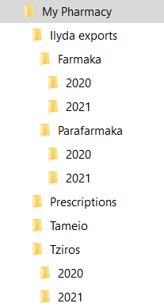

# Pharmacy-Overview
Various pharmacy-related graphs and tables

1. Κάνουμε εγκατάσταση το R: Ανοίγουμε το link (https://ftp.cc.uoc.gr/mirrors/CRAN/) και επιλέγουμε “Download R for Windows”, έπειτα “install R for the first time” και μετά "Download R 4.1.2 for Windows". 

3. Κατεβάζουμε το R Studio: Ανοίγουμε το link (https://www.rstudio.com/products/rstudio/download/) και επιλέγουμε download στο free RStudio Desktop και έπειτα "Download RStudio for Windows".

4. Δημιουργούμε μέσα στον σκληρό δίσκο έναν φάκελο με το όνομα “My pharmacy”

5. Μέσα στον φάκελο My pharmacy δημιουργούμε 4 υπό-φακέλους “Ilyda exports”, “Prescriptions”, “Tameio”, “Tziros”

6. Μέσα στον φάκελο “Ilyda exports” δημιουργούμε δύο υπο-φακέλους, έναν με το όνομα “Farmaka” και έναν με το όνομα “Parafarmaka”. Μέσα στον φάκελο “Farmaka” δημιουργούμε έναν φάκελο με το όνομα “2020” και έναν φάκελο με το όνομα “2021”. Το ίδιο και μέσα στον φάκελο “Parafarmaka”, δημιουργούμε έναν φάκελο με το όνομα “2020” και έναν φάκελο με το όνομα “2021.

7. Μέσα στον φάκελο Tziros δημιουργούμε δύο υπό-φακέλους, έναν με το όνομα 2020 και έναν με το όνομα 2021. 

8. Μπαίνουμε στο e-prescriptions και κατεβάζουμε τις συνταγές κάθε ημέρας μία μία αποθηκεύοντας τες σε μορφή pdf. Όλες οι συνταγές θα βρίσκονται στον φάκελο “Prescriptions”.

9. Μπαίνουμε στο πρόγραμμα Dioscurides . Για κάθε μήνα θα χρειαστεί να εξάγουμε 4 αρχεία σε μορφή Excel από το Dioscurides

10. Στατιστικά-Γραφήματα -> Diosc MIS Πληροφοριακό Σύστημα -> Συνολικά Στατιστικά -> Μεικτό Κέρδος -> Επιλογή ημερομηνίας (ανά μήνα) -> Εμφάνιση Εξαγωγή σε Αρχείο -> ΟΚ -> Export Report -> Format: Microsoft Excel 97-2000 – Data only (XLS), Destination: Disk file -> OK

11. Πωλήσεις Φαρμάκων -> 14. Αναλυτικά Ανά Είδος -> Επιλογή ημερομηνίας (ανά μήνα) -> Εμφάνιση Εξαγωγή σε Αρχείο -> ΟΚ -> Export Report -> Format: Microsoft Excel 97-2000 – Data only (XLS), Destination: Disk file -> OK

12. Πωλήσεις Παραφαρμάκων -> 8. Αναλυτικά Ανά Είδος -> Επιλογή ημερομηνίας (ανά μήνα) -> Εμφάνιση Εξαγωγή σε Αρχείο -> ΟΚ -> Export Report -> Format: Microsoft Excel 97-2000 – Data only (XLS), Destination: Disk file -> OK

13. Στοιχεία Λογιστηρίου -> Κατάσταση Ελέγχου Κινήσεων -> Επιλογή Ημερομηνίας (Από 1/1 του τρέχοντος έτους μέχρι την τελευταία μέρα του μήνα που μόλις τελείωσε) -> Εκτύπωση -> Εξαγωγή σε αρχείο MS Excel ή κειμένου (check if it should xls or xlsx)

14. Ανοίγουμε το R Studio

15. Κάνουμε copy- paste στο console αυτό και περιμένουμε να γίνει η εγκατάσταση: install.packages(c("tidyverse", "readxl", "lubridate", "janitor", "scales", "openxlsx", "ggrepel", "broom", "infer", "pdftools", "tm", "glue")

16. Πατάμε File -> New file -> R Markdown

17. Στον τίτλο βάζουμε My Pharmacy το Author το αφήνουμε κενό και πατάμε Ok

18. Πατάμε Ctrl + A επιλέγοντας όλο το περιεχόμενο και το σβήνουμε πατώντας Delete

19. Κάνουμε copy-paste όλο τον κώδικα μέσα στο R Markdown

20. Πατάμε Ctrl + Alt + R και περιμένουμε να τρέξει όλος ο κώδικας

21. Πατάμε File -> New File -> Shiny Web App

22. Επιλέγουμε όνομα εφαρμογής π.χ. «My Pharmacy App”

23. Πατάμε Ctrl + A επιλέγοντας όλο το περιεχόμενο και το σβήνουμε πατώντας Delete

24. Κάνουμε copy- paste όλο τον κώδικα της εφαρμογής αυτή την φορά

25. Πατάμε Ctrl + Shift + Enter
