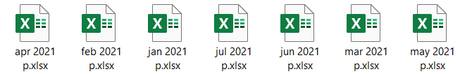

# Pharmacy-Overview
[Dummy Pharmacy in Shiny](http://vasilis-antoniadis.shinyapps.io/Dummy_Pharmacy)

1. Κάνουμε εγκατάσταση το R: Ανοίγουμε το link (https://ftp.cc.uoc.gr/mirrors/CRAN/) και επιλέγουμε “Download R for Windows”, έπειτα “install R for the first time” και μετά "Download R 4.1.2 for Windows". Κάνουμε εγκατάσταση το αρχείο που κατεβάσαμε.

3. Κατεβάζουμε το R Studio: Ανοίγουμε το link (https://www.rstudio.com/products/rstudio/download/) και επιλέγουμε download στο free RStudio Desktop και έπειτα "Download RStudio for Windows". Κάνουμε εγκατάσταση το RStudio. 

4. Δημιουργούμε μέσα στον σκληρό δίσκο έναν φάκελο με το όνομα My pharmacy.

5. Μέσα στον φάκελο My pharmacy δημιουργούμε 4 υπό-φακέλους Ilyda exports, Prescriptions, Tameio, Tziros.

6. Μέσα στον φάκελο Ilyda exports δημιουργούμε δύο υπό-φακέλους, έναν με το όνομα Farmaka και έναν με το όνομα Parafarmaka. Μέσα στον φάκελο Farmaka δημιουργούμε έναν φάκελο με το όνομα 2020 και έναν φάκελο με το όνομα 2021. Το ίδιο και μέσα στον φάκελο Parafarmaka, δημιουργούμε έναν φάκελο με το όνομα 2020 και έναν φάκελο με το όνομα 2021.

7. Μέσα στον φάκελο Tziros δημιουργούμε δύο υπό-φακέλους, έναν με το όνομα 2020 και έναν με το όνομα 2021. 

8. Μπαίνουμε στο e-prescriptions και κατεβάζουμε τις συνταγές κάθε ημέρας μία-μία και τις αποθηκεύουμε σε μορφή pdf. Όλες οι συνταγές θα πρέπει να βρίσκονται στον φάκελο Prescriptions.

9. Μπαίνουμε στο πρόγραμμα Dioscourides.

10. Για κάθε μήνα θα χρειαστεί να εξάγουμε 4 αρχεία σε μορφή Excel από το Dioscourides και στη συνέχεια να τα κάνουμε αποθήκευση σε μορφή xlsx.

10a. Στατιστικά-Γραφήματα -> Diosc MIS Πληροφοριακό Σύστημα -> Συνολικά Στατιστικά -> Μεικτό Κέρδος -> Επιλογή ημερομηνίας (ανά μήνα) -> Εμφάνιση Εξαγωγή σε Αρχείο -> ΟΚ -> Export Report -> Format: Microsoft Excel 97-2000 – Data only (XLS), Destination: Disk file -> OK

Τοποθετούμε αυτό το αρχείο xls στον αντίστοιχο φάκελο της χρονιάς που ανήκει ο μήνας μέσα στον φάκελο "Tziros". Στη συνέχεια ανοίγουμε το αρχείο και το κάνουμε αποθήκευση σαν αρχείο xlsx στην ίδια τοποθεσία που ήταν και το xls, δηλαδή στον φάκελο της χρονιάς που ανήκει ο μήνας. Σβήνουμε στη συνέχεια το αρχικό αρχείο xls. Παρακάτω φαίνονται οι δυο φάκελοι και τα αρχεία που θα περιέχουν.

10b. Πωλήσεις Φαρμάκων -> 14. Αναλυτικά Ανά Είδος -> Επιλογή ημερομηνίας (ανά μήνα) -> Εμφάνιση Εξαγωγή σε Αρχείο -> ΟΚ -> Export Report -> Format: Microsoft Excel 97-2000 – Data only (XLS), Destination: Disk file -> OK

Τοποθετούμε αυτό το αρχείο xls στην αντίστοιχο φάκελο της χρονιάς που ανήκει ο μήνας μέσα στον φάκελο "Farmaka" που βρίσκεται μέσα στον φάκελο "Ilyda exports". Στη συνέχεια ανοίγουμε το αρχείο και το κάνουμε αποθήκευση σαν αρχείο xlsx στην ίδια τοποθεσία που ήταν και το xls, δηλαδή στον φάκελο της χρονιάς που ανήκει ο μήνας. Σβήνουμε στη συνέχεια το αρχικό αρχείο xls. Παρακάτω φαίνονται οι δυο φάκελοι και τα αρχεία που θα περιέχουν.

10c. Πωλήσεις Παραφαρμάκων -> 8. Αναλυτικά Ανά Είδος -> Επιλογή ημερομηνίας (ανά μήνα) -> Εμφάνιση Εξαγωγή σε Αρχείο -> ΟΚ -> Export Report -> Format: Microsoft Excel 97-2000 – Data only (XLS), Destination: Disk file -> OK

Τοποθετούμε αυτό το αρχείο xls στην αντίστοιχο φάκελο της χρονιάς που ανήκει ο μήνας μέσα στον φάκελο "Parafarmaka" που βρίσκεται μέσα στον φάκελο "Ilyda exports". Στη συνέχεια ανοίγουμε το αρχείο και το κάνουμε αποθήκευση σαν αρχείο xlsx στην ίδια τοποθεσία που ήταν και το xls, δηλαδή στον φάκελο της χρονιάς που ανήκει ο μήνας. Σβήνουμε στην συνέχεια το αρχικό αρχείο xls. Παρακάτω φαίνονται οι δυο φάκελοι και τα αρχεία που θα περιέχουν.

10d. Στοιχεία Λογιστηρίου -> Κατάσταση Ελέγχου Κινήσεων -> Επιλογή Ημερομηνίας (Από 1/1 του τρέχοντος έτους μέχρι την τελευταία μέρα του μήνα που μόλις τελείωσε) -> Εκτύπωση -> Εξαγωγή σε αρχείο MS Excel ή κειμένου (check if it should xls or xlsx)

Τοποθετούμε αυτό το αρχείο xls μέσα στον φάκελο "Tameio". Στη συνέχεια ανοίγουμε το αρχείο και το κάνουμε αποθήκευση σαν αρχείο xlsx στην ίδια τοποθεσία που ήταν και το xls, δηλαδή στον φάκελο της χρονιάς που ανήκει ο μήνας. Σβήνουμε στη συνέχεια το αρχικό αρχείο xls.

12. Κάνουμε download το αρχείο [my_OTC.xlsx](https://github.com/VasilisAnt/Pharmacy-Overview/raw/main/my_OTC.xlsx) και το βάζουμε στον φάκελο My Pharmacy .

12. Ανοίγουμε το R Studio

13. Κάνουμε copy-paste στο Console αυτό: install.packages(c("tidyverse", "readxl", "lubridate", "janitor", "scales", "openxlsx", "ggrepel", "broom", "infer", "pdftools", "tm", "glue", "markdown", "bslib", "cachem", "commonmark", "httpuv", "later", "promises", "shiny", "sourcetools", "xtable", "DT", "shinydashboard", "shinythemes")) και πατάμε Enter. Αν μας ρωτήσει να γίνει restart το RStudio πατάμε Ναι. Περιμένουμε να γίνει η εγκατάσταση των πακέτων. Θα χρειαστεί λίγη ώρα ανάλογα με τον υπολογιστή σας (~ 7 λεπτά).

Το Console είναι το 2 στην παρακάτω εικόνα:

14. Πατάμε File -> New file -> R Markdown

15. Στo title βάζουμε My Pharmacy, το Author το αφήνουμε κενό και πατάμε Ok.

16. Πατάμε Ctrl + A επιλέγοντας όλο το περιεχόμενο (όλες τις γραμμές δηλαδή από 1 μέχρι 29) και το σβήνουμε πατώντας Delete.

17. Ανοίγουμε το [Pharmacy-Overview.Rmd](https://github.com/VasilisAnt/Pharmacy-Overview/blob/main/Pharmacy-Overview.Rmd) και πατάμε το Copy raw contents (το εικονίδιο με τα δύο φύλλα δίπλα στο Raw και Blame).

18. Στο R Studio, και συγκεκριμένα εκεί που σβήσαμε όλο περιοχόμενο στο βήμα 17,  κάνουμε επικόλληση (Ctrl + V).

18. Πατάμε Ctr+ S και κάνουμε αποθήκευση σε όποιο σημείο στον υπολογιστή με όποιο όνονα θέλουμε.

18. Πατάμε Ctrl + Alt + R και περιμένουμε να τρέξει όλος ο κώδικας

19. Πατάμε File -> New File -> Shiny Web App

20. Επιλέγουμε application name π.χ. My_Pharmacy_App και πατάμε Create.

21. Πατάμε Ctrl + A επιλέγοντας όλο το περιεχόμενο (όλες τις γραμμές δηλαδή από 1 μέχρι και 49) και το σβήνουμε πατώντας Delete.

22. Ανοίγουμε το app [Pharmacy-Overview-App](https://github.com/VasilisAnt/Pharmacy-Overview/blob/main/Pharmacy-Overview-App/app.R). Πατάμε το Copy raw contents (το εικονίδιο με τα δύο φύλλα δίπλα στο Raw και Blame).

23. Στο R studio, και συγκεκριμένα εκεί που σβήσαμε όλο το περιοχόμενο στο βήμα 24, κάνουμε επικόλληση (Ctrl + V). Πατάμε Ctrl + S για αποθήκευση.

24. Πατάμε File -> Save with Encoding -> UTF-8 -> OK

25. Πατάμε Ctrl + Shift + Enter και ανοίγει η εφαρμογή.
